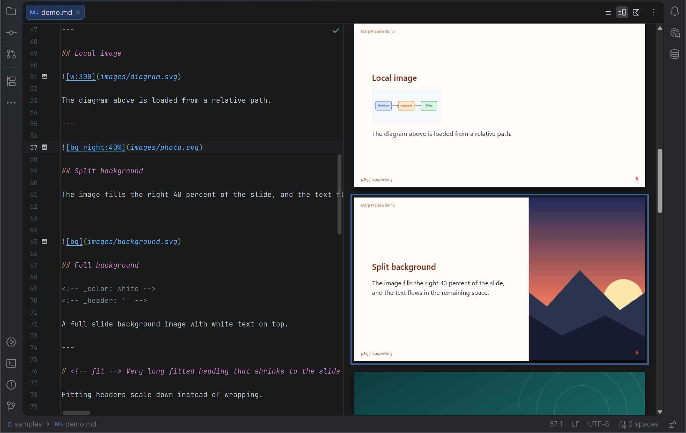

# Marp Preview

[](https://github.com/p3kj/marp-intellij/actions/workflows/build.yml)
<!-- Enable after the first Marketplace release, replace NNNNN with the numeric plugin id:
[](https://plugins.jetbrains.com/plugin/NNNNN-marp-preview)
[](https://plugins.jetbrains.com/plugin/NNNNN-marp-preview)
-->
[](LICENSE)

Marp Preview renders [Marp](https://marp.app/) slide decks inside your JetBrains IDE. The slides appear in a JCEF preview next to the Markdown editor and refresh while you type.



The plugin works in all IntelliJ-based IDEs on the 2026.2 platform and newer (IntelliJ IDEA, PhpStorm, WebStorm, PyCharm, GoLand, CLion, Rider, RubyMine and others). It depends only on the bundled Markdown plugin and JCEF. No Node.js is needed for the preview.

## Installation

The plugin is not on the JetBrains Marketplace yet. Until it is, install a release build from disk (see below).

**From the JetBrains Marketplace** (once it is published)

1. Open Settings | Plugins, select the Marketplace tab and search for "Marp Preview".
2. Click Install. No restart is needed.

**From a ZIP (Install Plugin from Disk)**

1. Download `marp-intellij-<version>.zip` from the GitHub Releases page (or build it yourself, see [Development](#development)).
2. Open Settings | Plugins, click the gear icon and choose Install Plugin from Disk.
3. Select the ZIP (do not unpack it). The plugin loads without restarting the IDE.

Requires an IDE on the 2026.2 platform or newer, running on the JetBrains Runtime with JCEF (the default in all JetBrains IDEs).

## Quick start

1. Install the plugin.
2. Create `deck.md` with File | New | Marp Presentation, or by hand with a Marp front matter and a few slides:

   ```markdown
   ---
   marp: true
   theme: default
   paginate: true
   ---

   # Hello, Marp

   Slides in your IDE, live.

   ---

   ## Second slide

   - Separate slides with `---`
   - Images: ``
   - Math: $E = mc^2$
   ```

3. The file opens in a split view: Markdown on the left, slides on the right. Use the Editor / Split / Preview buttons in the editor toolbar to change the layout.
4. If the file was already open when you added `marp: true`, click the link in the "Marp deck detected" banner at the top of the editor.

For a bigger example open the `samples/` folder of this repository as a project. It has a custom theme, a `.marprc.yml`, local images and two linked decks.

## Features

- Live preview of Marp decks next to the Markdown editor, refreshed while typing
- Two-way scroll sync, highlight of the slide under the caret, double-click a slide to jump to its source line
- Slide outline in the Structure tool window and the File Structure popup (Ctrl+F12 / Cmd+F12), with each slide's headings; click a slide to jump to it
- Slide navigation: "Slide 3 / 12" in the status bar (click to go to a slide), Next / Previous Slide (Ctrl+Alt+PageDown / Ctrl+Alt+PageUp, Cmd+Opt on macOS) and Go to Slide in the Navigate menu, slide numbers in the editor, and folding of each slide
- File | New | Marp Presentation starter deck, and live templates `slide`, `lead`, `bg` and `notes` (type the abbreviation and press Tab)
- Directives in comments and in the front matter: completion, hover docs and an inspection for unknown directives, `_theme` and invalid values, and highlighting in comments
- Image syntax: completion and hover docs for the keywords in image alt text (`bg`, `left:40%`, `w:400`, `sepia`, ...)
- Unknown theme names are marked in the editor, with quick fixes to add a theme file or folder
- Ctrl+click a theme name to open its CSS file
- Custom themes from files, folders and URLs, and automatic pickup of `themeSet` from `.marprc.yml`
- Theme CSS edits show up live, before the file is saved
- Local images with relative paths, including `` backgrounds
- Math with MathJax (works offline) or KaTeX
- Emoji support through Twemoji
- The IDE spellchecker knows Marp words such as `marp`, Marpit and Twemoji, so `marp: true` is not flagged as a typo
- Inline HTML in slides: off, Marp's allow list or all
- Export a deck to a standalone HTML file or to a PDF with one page per slide (File | Export or the preview toolbar), without Node.js
- Present a deck in the system browser, one slide at a time, starting at the slide under the caret, with keyboard navigation and full screen (Present Deck in the preview toolbar)
- The preview follows the IDE light or dark theme
- Locked-down preview page (Content Security Policy, no navigation away) and a restricted mode for untrusted projects
- Works in every IntelliJ-based IDE, no IDE-specific APIs

A Markdown file is treated as a Marp deck when its front matter contains `marp: true`. Other Markdown files keep the regular Markdown preview.

## How the preview behaves

- **Typing** re-renders the preview at most every 150 ms. Nothing needs to be saved.
- **Scrolling** the editor scrolls the preview to the same source line, and the other way round.
- **The caret** highlights the slide it is in.
- **Structure view** (Structure tool window, Ctrl+F12 / Cmd+F12): one node per slide, named after its first heading, with the other headings of the slide nested below it. Slides follow the same rules as the preview, including `headingDivider`. Clicking a node moves the caret there, so the preview highlights that slide and, with scroll sync on, scrolls to it. Other Markdown files keep the regular heading outline.
- **Slide navigation**: the status bar shows the slide under the caret ("Slide 3 / 12") in a Marp deck and nothing elsewhere, and a click opens Go to Slide. Navigate | Next Slide, Previous Slide and Go to Slide... move the caret to the start of a slide (Next and Previous stay at the last and the first slide). Slides follow the same rules as the preview, including `headingDivider`, so moving the caret makes the preview follow (with scroll sync on, it scrolls to the slide). The actions work while the editor has the focus, not while the preview does. Editor labels ("Slide 3") at the end of the line where each slide starts can be turned off in Settings | Editor | Inlay Hints | Other | Markdown. Change the shortcuts in Settings | Keymap (search "Marp"). The NetBeans and Visual Studio keymaps use Ctrl+Alt+PageUp / PageDown for something else, so they get no default shortcut. Each slide folds in the editor, and the folded text reads "Slide 3: Agenda". A slide started by `---` folds from the end of that line (the closing front matter line for the first slide) to its last content, and a slide that `headingDivider` started folds from its heading, which the placeholder replaces. Slides start expanded. Code | Folding | Collapse All folds every slide, and also the Markdown regions inside the slides (lists, code fences). The slide regions replace the Markdown heading regions that would run across a `---` line.
- **Directive comments**: in an HTML comment of a deck, directive names and values are highlighted, and comments that Marp shows as presenter notes get their own color (Settings | Editor | Color Scheme | Marp). Basic completion (Ctrl+Space) offers directive names, the `_` form that applies to one slide, and values such as `paginate: hold`, `size: 4:3`, `class: lead` and theme names, including your custom themes. Quick documentation (Ctrl+Q, F1 on macOS) and hovering explain a directive. The Marp directive inspection warns about unknown directives ("did you mean `_class`?"), global directives written with an underscore such as `_theme` (Marp ignores them), and values Marp ignores or misreads for `paginate`, `math` and `headingDivider`. Comments that are only presenter notes, like `<!-- Note: say hello -->`, are left alone. A `theme:` that names an unknown theme (not `default`, `gaia`, `uncover` or one of your custom themes) is marked by the separate "Unknown Marp theme" inspection. Press Alt+Enter on it to add a theme CSS file or folder to Settings | Tools | Marp, create a `.marprc.yml` with a `themeSet` (or open the one you have), or open the settings. The name is case-sensitive. The inspection stays quiet while the themes are loading, in an untrusted project, and while a theme source has an error (the preview banner names it), because the theme may be missing for that reason. Ctrl+click (Cmd+click on macOS) a theme name, or press Ctrl+B (Cmd+B), to open the CSS file that declares it. Built-in themes and themes from URLs have no file to open, and nothing opens while the themes are still loading. Flow style (`<!-- { class: lead } -->`) is read as a note, use one `key: value` per line.
- **Front matter**: the same completion, documentation and inspection work on the top-level keys of the front matter of a deck, which also offers `marp` and does not offer a key that is already there (a repeated key makes Marp ignore the whole front matter). The keys of the Markdown plugin's front matter schema, such as `title`, keep working next to the Marp keys. Keys that are not Marp directives (`title`, `author`, ...) are left alone by the inspection, unless one is a near miss of a directive (`pagiante`), which is a weak warning. Nested values and lists are left to the YAML support. Like everything else, this needs a deck: the file has to contain `marp: true` already.
- **Image syntax**: in the alt text of an image in a deck (``), basic completion (Ctrl+Space) offers the keywords Marp reads there, and quick documentation (Ctrl+Q, F1 on macOS) and hovering explain the one under the caret, with the default Marp uses when you leave the argument out. Without `bg` in the alt text it offers `bg`, the sizes `w:`, `h:`, `width:`, `height:` and the filters (`blur`, `sepia`, ...). With `bg` it also offers `left`, `right`, `fit`, `contain`, `cover`, `auto`, `vertical` and `horizontal`, and leaves out `bg` and the keywords the alt text already has. Values are not completed: `w:` stops at the colon, and a filter or `left` is inserted bare, so Marp uses its default (`blur` is `blur:10px`). The popup opens by itself while you type, but only while every other word of the alt text is a keyword, so `![bg co` opens it and a description such as `![A photo of a cat]` does not. Ctrl+Space works in a description too. It is limited to Markdown text of a deck: code, HTML comments and the front matter are left alone, and so is an alt text that spans several lines. Inside the alt text the `bg` live template no longer expands on Tab, so typing `), exports the deck (see [Export](#export)) and opens Settings | Tools | Marp. Turning scroll sync back on realigns the preview with the editor.
- **Links**: links to files inside the project open in the IDE. `http(s)` and `mailto` links open in the system browser. Everything else is ignored. The preview page itself never navigates away.
- **Errors** (a theme that cannot be loaded, a render error, a `theme:` directive that names an unknown theme) show as a banner in the preview that you can dismiss.
- **Theme CSS edits** are picked up while you type.
- **IDE theme**: the area around the slides follows the IDE light or dark theme. The slides keep the colors of their Marp theme.
- **Untrusted projects**: raw HTML in slides is off, and no custom themes are loaded until you trust the project. This is the same idea as restricted mode in Marp for VS Code.

## Export

Export the deck that is open in the editor to HTML or PDF. Use File | Export | Marp Deck to HTML... or Marp Deck to PDF..., or the Export Deck button in the preview toolbar. The actions appear whenever the deck is open in the Marp editor (and the IDE has JCEF). If the preview page is not loaded yet, a notification asks you to show the preview and try again. A save dialog asks where to put the file (it starts in the deck's folder), and a notification tells you when the file is ready, with an Open button.

- **What is exported** is what the preview shows: the same themes, math library and HTML setting, including changes you have not saved yet. The export goes through the preview page, so the preview has to be loaded (open the Split or Preview layout and wait for the slides). Presenter notes and the slide outline are not part of the export.
- **HTML** is one standalone file: marp-core's own markup and CSS, the same as the file Marp CLI writes, opened as slides stacked on a grey page. Images and other files keep the paths you wrote, so relative images (`images/diagram.png`) only show when the HTML file sits where they resolve from. That is why the save dialog starts in the deck's folder: keep the HTML next to the deck, or copy the images with it. Twemoji emoji, KaTeX styles and fonts, and web fonts from a theme still load from the network when you open the file. Nothing is inlined. If the deck has a `title:` in the front matter it becomes the page title, otherwise the file name does, and `lang:` becomes the page language.
- **PDF** has one page per slide, sized like the deck (16:9 by default, the `size` directive such as `size: 4:3` is followed), with backgrounds and local images, printed by the IDE's built-in browser. There is no outline and no presenter notes.
- **Trust and HTML in slides**: the file contains what the preview renders. In an untrusted project raw HTML is off and custom themes are not loaded, so the export lacks them too. With HTML set to All in a trusted project, the deck's own HTML and scripts are in the exported HTML file, the same as `marp --html`. Only open exported decks you trust.
- **PPTX and images** need Marp CLI (`marp deck.md --pptx`) and are not part of this plugin. Marp CLI is a fine second tool for anything the export does not cover.

## Present

Click Present Deck (the play button) in the preview toolbar, or run it from Find Action ("Present Deck", "Slideshow"). The deck opens in your system browser one slide at a time, starting at the slide the caret is in. It is not bound to a shortcut, assign one in Settings | Keymap if you want one. The action appears whenever the deck is open in the Marp editor (and the IDE has JCEF). If the preview page is not loaded yet, a notification asks you to show the preview and try again.

- **Keys** in the browser: Right, Down, Page Down, Space and Enter go to the next slide, Left, Up, Page Up, Backspace and Shift+Space to the previous one, Home and End to the first and the last. F toggles full screen and Esc leaves it (the browser's own key). Links to another slide of the deck (`[back to the agenda](#2)`) work. Clicks do not change slides.
- **A snapshot**: the page is the HTML export of the preview (see [Export](#export)) with a small script, so it shows the current text, including changes you have not saved, and the same themes, math library and HTML setting. It does not follow later edits: press Present Deck again to see them. Reloading the browser tab keeps the slide, because the slide number is in the address (`#3`).
- **Files**: the page is written to a new file in the system's temporary folder (readable by you only, where the file system supports that) and deleted when the IDE exits. Relative images and theme `url()`s keep working because the page points at the deck's folder. That only works for a deck on the local file system.
- **Trust and HTML in slides**: like the export. In an untrusted project raw HTML is off and custom themes are not loaded. With HTML set to All in a trusted project, the deck's own HTML and scripts run in the page, the same as `marp --html`.
- **Not included**: presenter view, presenter notes, timer, remote control, slide counter and transitions. Use Marp CLI if you need them.

## Settings

Open Settings | Tools | Marp.

| Setting | Description |
| ------- | ----------- |
| Themes | List of theme CSS files, folders or URLs available to your decks. Each theme declares its name with a `/* @theme name */` comment. Use + to pick a file or folder, enter a URL, or type a path (for example a folder that does not exist yet); double-click an entry to edit it. |
| Also use themeSet from .marprc.yml | When enabled, the `themeSet` from `.marprc.yml` (or `.yaml`, `.json`, `.marprc`) in the project root is loaded automatically. The quick fixes that create or open a `.marprc.yml` need this on. |
| HTML in slides | Inline HTML: Off, Default (marp-core allowlist) or All. Forced to Off in untrusted projects. |
| Math typesetting | MathJax, KaTeX or Off. The `math:` directive in the front matter takes precedence over this setting where marp-core allows it. |
| Show presenter notes under slides | Shows each slide's presenter notes (HTML comments that are not directives, like `<!-- Say hello -->`) under the slide. Off by default, applies to all projects. |
| Synchronize scrolling between editor and preview | Turns scroll sync on or off. This setting applies to all projects. |

Presenter notes and scroll sync can also be toggled from the preview toolbar; that changes these same settings.

The theme, HTML and math settings are stored per project in `.idea/marp.xml`. You can commit that file to share them with your team. Presenter notes and scroll sync are personal preferences and are stored in the IDE configuration.

## Themes

Marp themes are plain CSS files that start with a `/* @theme name */` comment, see the [Marpit theme documentation](https://marpit.marp.app/theme-css). Select a theme in the deck's front matter with `theme: name`.

Ways to add themes:

- In Settings | Tools | Marp, add CSS files, folders or URLs to the themes list. For a folder, all `.css` files inside, including subfolders, are loaded. `node_modules` and hidden folders are skipped, and at most 200 files, 8 levels deep, are loaded from one folder. A theme URL must serve CSS or plain text of at most 5 MB.
- Put a `.marprc.yml` with a `themeSet` in the project root, the same file Marp CLI uses. It is picked up automatically:

  ```yaml
  themeSet: themes
  ```

  Paths are relative to the `.marprc.yml` file and must stay inside the project directory: the file comes with the repository, so it cannot load CSS from elsewhere on your machine. Add such themes in the settings instead. See `samples/.marprc.yml` and `samples/themes/demo.css` for a working example.

### Migrating from VS Code

If you used the Marp for VS Code extension:

- Setting `markdown.marp.themes`: copy its entries (files, folders or URLs) into Settings | Tools | Marp. Relative paths like `./themes/sketch.css` work as they are.
- A `.marprc.yml` with `themeSet` needs no migration. It is picked up automatically.

## Troubleshooting and FAQ

**The file opens in the normal Markdown editor.** The front matter must start at the first character of the file, contain the line `marp: true`, and end within the first 64 K characters. If you added it after opening the file, click the link in the "Marp deck detected" banner, or close and reopen the file.

**The preview is empty, or shows a message about JCEF.** The IDE must run on the JetBrains Runtime with JCEF. Check Help | About: the Runtime line should say "JetBrains s.r.o.", not Temurin, Zulu or a system JDK. Switch it with Help | Find Action | Choose Boot Java Runtime for the IDE. Snap and Flatpak packages sometimes ship without JCEF. Use the Toolbox App or the tarball instead.

**Remote Development (JetBrains Gateway).** Not tested. The preview needs JCEF in the process that shows the editor, so on a thin client it may stay empty. Please report what you see.

**Emoji or KaTeX glyphs are missing offline.** Twemoji images and KaTeX fonts come from a CDN. MathJax works offline, so select it in Settings | Tools | Marp.

**My theme is not applied.** The CSS file must start with a `/* @theme name */` comment and be listed in Settings | Tools | Marp, or be part of the `themeSet` of a `.marprc.yml` in the project root. The name is case-sensitive. A `theme:` directive with an unknown name shows a warning in the preview, and the editor marks it too: press Alt+Enter for fixes.

**Export to HTML or PDF is missing or does nothing.** The actions appear for a file that is open in the Marp editor: a Markdown file with `marp: true` (if you added it after opening the file, click the banner). They are hidden when the IDE has no JCEF, see the JCEF entry above. When a notification says the preview is not loaded yet, show the Split or Preview layout, wait for the slides and export again. An export fails with a message when the preview is closed or reloaded while it runs. An error in the deck (banner in the preview) can also stop an export: fix it and export again.

**Present Deck opens a blank page, an error page or nothing.** The presentation is a file in the system's temporary folder, and a browser installed as a Snap or Flatpak package (Firefox on Ubuntu, for example) is sandboxed and cannot read it. Use a browser from a normal package or its tarball, set it as the default browser in your system, or use Export | Marp Deck to HTML next to the deck and open that file instead. When the notification says the preview is not loaded, show the Split or Preview layout, wait for the slides and try again. If the browser cannot be started at all, the IDE shows its own message.

**Present Deck shows old text.** The page is a snapshot. Press Present Deck again, it opens a new tab with the current text.

**Images are missing in the exported HTML.** The file keeps the image paths as written. Save it next to the deck (the dialog starts there), or keep the folder structure when you move it. A PDF has the images inside.

**Images do not show.** Relative paths resolve from the Markdown file's folder. Only files inside the project (content roots or the deck's folder) are served. Remote images need https: plain http images are mixed content in Chromium and are upgraded or blocked.

**Inline HTML is stripped.** Set "HTML in slides" to Default or All. In an untrusted project HTML stays off until you trust the project. Scripts in slides never run.

**Custom themes do not load.** The project is probably untrusted: the preview then shows a banner saying so. Trust it (the IDE asks when you open it) and the themes load. A `.marprc` theme outside the project directory is not loaded either, the banner names it.

**Where are the settings stored?** See [Settings](#settings).

**Logs.** Help | Show Log in Files. Errors reported by the preview page are logged too.

## Comparison with Marp for VS Code

| | Marp Preview (JetBrains) | Marp for VS Code |
| --- | --- | --- |
| Live preview | yes, JCEF, refreshes while typing | yes |
| Scroll sync, active slide highlight | yes, both directions | yes |
| Custom themes (files, folders, URLs) | yes, same semantics as `markdown.marp.themes` | yes |
| `.marprc.yml` themeSet | yes | no, it uses the setting |
| Math (MathJax / KaTeX), Twemoji, fitting headers | yes (marp-core) | yes (marp-core) |
| Inline HTML modes off / default / all | yes | yes |
| Restricted mode for untrusted projects | yes | yes |
| Export to HTML and PDF | yes, no Node.js | yes |
| Present in the browser | yes, one slide at a time, no presenter view | no, use the exported HTML file |
| Export to PPTX and images | no, use Marp CLI | yes |
| Directive completion and diagnostics | yes, in comments and the front matter | yes |
| Toggle Marp feature command | not yet | yes |

Both use marp-core for rendering, so a deck looks the same in both editors. The rendering engine is bundled, so the preview needs no Node.js.

## Why not the built-in Markdown preview?

The bundled Markdown plugin renders a document, not a deck. It has no notion of slide breaks, directives, themes or backgrounds, and it has no stable API for a plugin to replace its renderer. Marp Preview registers its own split editor for files with `marp: true` and renders them with marp-core, the engine behind Marp CLI and Marp for VS Code.

## Known limitations

- Twemoji images and KaTeX fonts are loaded from a CDN. Offline you lose emoji and KaTeX glyphs. MathJax works offline, so prefer it if you work without a network.
- Export covers HTML and PDF only, and needs the preview to be loaded. PPTX and images are not supported, use Marp CLI for them. HTML files keep image paths as written and load Twemoji, KaTeX and web fonts from the network.
- Speaker notes are not shown in the preview.
- Present Deck shows a snapshot in the system browser with keyboard navigation and full screen. It has no presenter view, notes, timer or live reload, and a browser that is sandboxed (Snap, Flatpak) cannot open the temporary file.
- JCEF is required. Without it the preview shows a message instead of the slides.
- Remote Development (JetBrains Gateway thin client) is untested.

## Roadmap

- Export to PPTX and images through Marp CLI
- Presenter notes in the preview
- Toggle Marp action

These are plans, not promises. Ideas and votes go to the [issue tracker](https://github.com/p3kj/marp-intellij/issues).

## Development

Requirements: JDK 25 and Node.js LTS. The usual commands:

```sh
./gradlew buildPlugin        # build the plugin ZIP into build/distributions
./gradlew runIde             # run a sandbox IDE with samples/ opened
./gradlew check              # Kotlin tests, webview tests, typecheck, NOTICE check
```

The preview page lives in `webview/`. `cd webview && npm run dev` starts a dev page with a mock IDE host. See [CONTRIBUTING.md](CONTRIBUTING.md) for the full workflow (PhpStorm run, UI test IDE, DevTools ports, third-party notices) and [docs/ARCHITECTURE.md](docs/ARCHITECTURE.md) for how the plugin is put together. Releases are described in [docs/RELEASING.md](docs/RELEASING.md).

## Security

The preview page is locked down: a Content Security Policy allows only the bundled script, the page cannot navigate away, and local files are served only from the project (base directory, content roots and the deck's folder). Untrusted projects render without raw HTML and without custom themes, and a `.marprc` cannot load theme files from outside the project. A remote theme CSS from a third party can observe deck content through CSS techniques, the same as in Marp for VS Code, so only add theme URLs you trust. To report a vulnerability see [SECURITY.md](SECURITY.md).

## License

MIT, see [LICENSE](LICENSE).

## Credits

- [Marp](https://marp.app/) by the Marp team: marp-core and Marpit do the actual rendering.
- Code ported from [marp-vscode](https://github.com/marp-team/marp-vscode) (MIT, Marp team) and from the scroll sync of the [VS Code](https://github.com/microsoft/vscode) Markdown preview (MIT, Microsoft Corporation).
- Third-party packages bundled in the webview are listed in [NOTICE](NOTICE).

Marp Preview is an independent project and is not affiliated with the Marp team.
