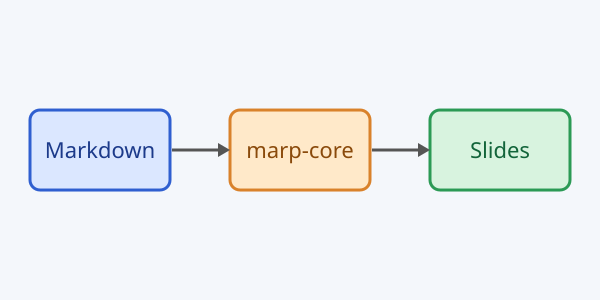

<!-- _class: lead -->
<!-- _paginate: false -->

# Marp Preview

Slides in your IDE, live

---

## Why Markdown slides?

Writing a deck as plain text keeps it diffable, reviewable and easy to version. The editor stays on the left, and the preview on the right follows every keystroke, so you see wrapping, fitting and pagination while you write. Themes are ordinary CSS, so a corporate look is one file away. Directives in the front matter or in HTML comments control the deck globally or per slide, and scoped variants such as `_class` affect only the current slide. Images, math, tables and code blocks all work out of the box, and the scroll position of the editor and the preview stay in sync in both directions.

---

## Code block

```kotlin
fun greet(name: String): String {
    val message = "Hello, $name!"
    return message.uppercase()
}

fun main() = println(greet("Marp"))
```

---

## Table

| Feature        | Status  | Notes                    |
| -------------- | ------- | ------------------------ |
| Live refresh   | done    | while typing             |
| Scroll sync    | done    | both directions          |
| Custom themes  | done    | files, folders and URLs  |
| Export         | planned | via Marp CLI             |

---

## Local image



The diagram above is loaded from a relative path.

---


## Split background

The image fills the right 40 percent of the slide, and the text flows in the remaining space.

---


## Full background

<!-- _color: white -->
<!-- _header: '' -->

A full-slide background image with white text on top.

---

# <!-- fit --> Very long fitted heading that shrinks to the slide width

Fitting headers scale down instead of wrapping.

---

## Math

Inline: $E = mc^2$ and $\sum_{i=1}^{n} i = \frac{n(n+1)}{2}$.

Block:

$$
\int_0^\infty e^{-x^2}\,dx = \frac{\sqrt{\pi}}{2}
$$

---

## Two columns with HTML

<div class="cols">
<div>

### Left

- Raw HTML wrapper
- Markdown inside

</div>
<div>

### Right

- Styled by `.cols` in `demo.css`
- Needs HTML mode default or all

</div>
</div>

---

## Emoji

Rocket :rocket: Sparkles :sparkles: Check :white_check_mark: Party :tada:

Unicode too: 🎉 🚀 ✨ (rendered with Twemoji, loaded from a CDN)

---

## Lists and quotes

1. Ordered item
2. Another one
   - nested bullet
   - **bold** and *italic*

> Themes are plain CSS files with a `/* @theme name */` comment.

---

## Links

- External: [Marp](https://marp.app/)
- Relative: [Open the other deck](other.md)

<!--
Speaker notes: the first comment that is not a directive becomes a presenter note.
Mention that relative links open the file in the editor.
-->

---

## A long slide that overflows

- Overflowing line number 1: the content keeps going past the slide bottom
- Overflowing line number 2: the content keeps going past the slide bottom
- Overflowing line number 3: the content keeps going past the slide bottom
- Overflowing line number 4: the content keeps going past the slide bottom
- Overflowing line number 5: the content keeps going past the slide bottom
- Overflowing line number 6: the content keeps going past the slide bottom
- Overflowing line number 7: the content keeps going past the slide bottom
- Overflowing line number 8: the content keeps going past the slide bottom
- Overflowing line number 9: the content keeps going past the slide bottom
- Overflowing line number 10: the content keeps going past the slide bottom
- Overflowing line number 11: the content keeps going past the slide bottom
- Overflowing line number 12: the content keeps going past the slide bottom
- Overflowing line number 13: the content keeps going past the slide bottom
- Overflowing line number 14: the content keeps going past the slide bottom
- Overflowing line number 15: the content keeps going past the slide bottom
- Overflowing line number 16: the content keeps going past the slide bottom
- Overflowing line number 17: the content keeps going past the slide bottom
- Overflowing line number 18: the content keeps going past the slide bottom
- Overflowing line number 19: the content keeps going past the slide bottom
- Overflowing line number 20: the content keeps going past the slide bottom
- Overflowing line number 21: the content keeps going past the slide bottom
- Overflowing line number 22: the content keeps going past the slide bottom
- Overflowing line number 23: the content keeps going past the slide bottom
- Overflowing line number 24: the content keeps going past the slide bottom
